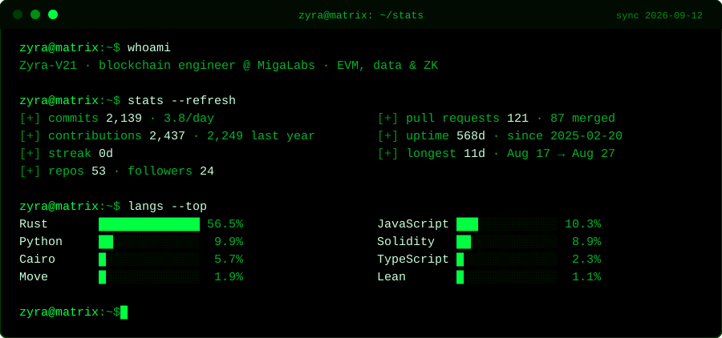

<!-- Generado a diario por .github/workflows/stats.yml con datos reales de la API -->

         

<code>&gt; merged PRs @</code> 
      

<!-- Generado por .github/workflows/snake.yml (rama output) -->

<code>there is no spoon, only code</code> · 🟢

